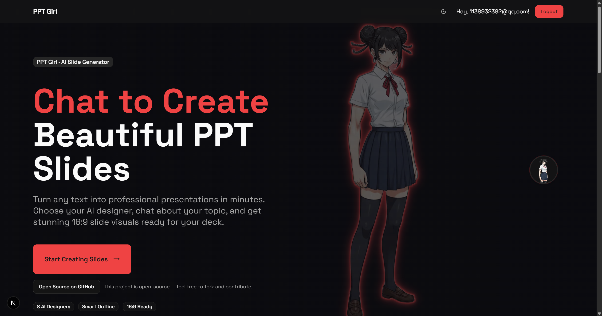
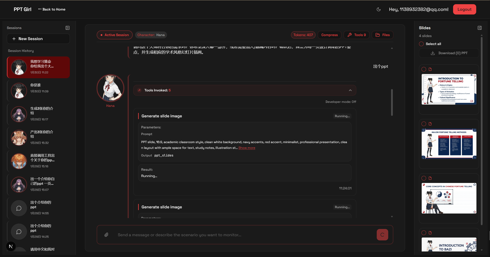
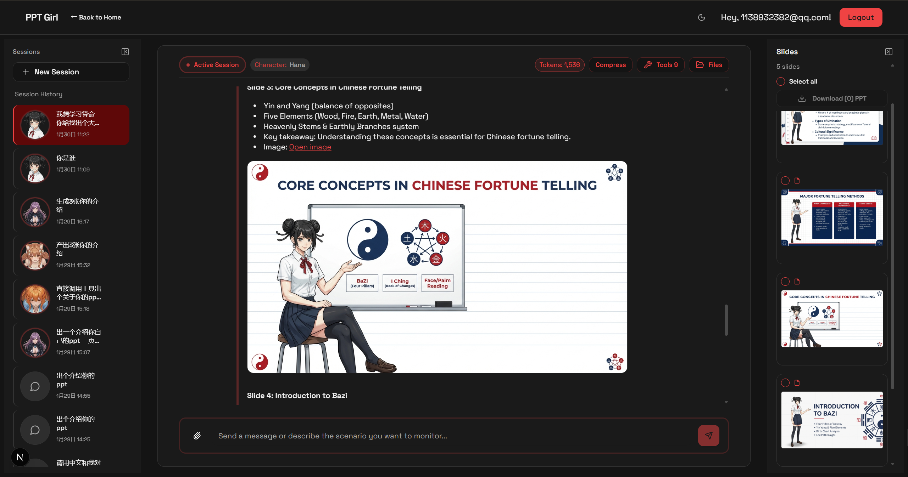
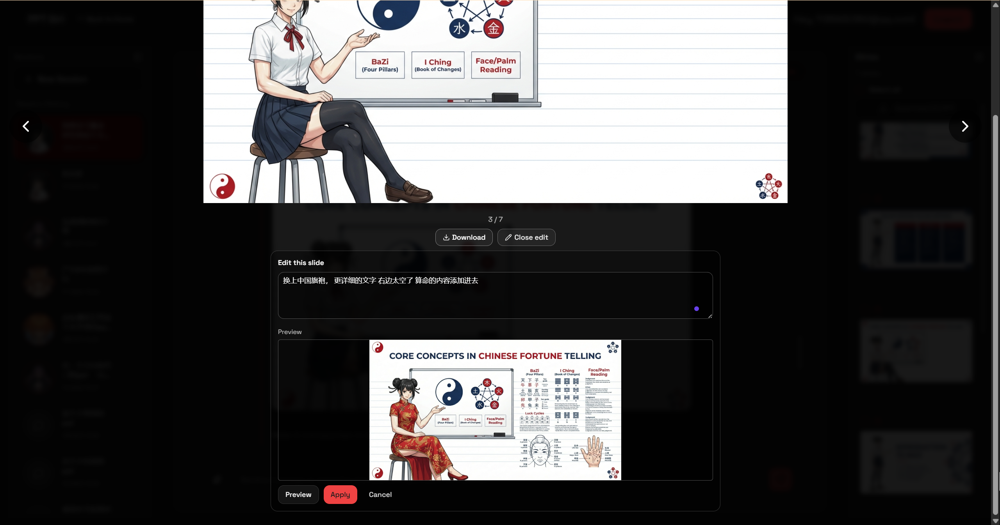
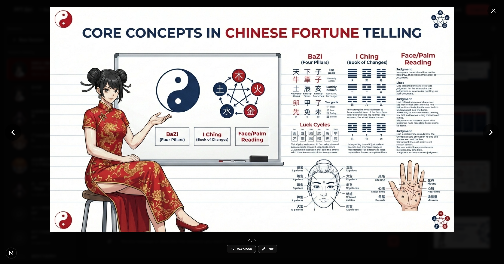

<div align="center">
  <h1 align="center">Acontext PPT Girl Slide Generator</h1>
  <p align="center">
    <strong>基于 Acontext Agent Playground 打造的 PPT 风格幻灯片生成体验</strong>
  </p>
  <p align="center">
    由 <a href="https://acontext.io"><strong>Acontext</strong></a> 驱动
  </p>
  
  <p align="center">
    
    
    
    <a href="https://acontext.io"></a>
  </p>
  
  <p align="center">
    
    &nbsp;&nbsp;&nbsp;
    
  </p>
</div>

<br/>

## 📸 展示

<div align="center">
  
  <br/><br/>
  
  <br/><br/>
  
  <br/><br/>
  
  <br/><br/>
  
  <br/><br/>
  
</div>

<br/>

**Acontext PPT Girl Slide Generator** 是一个由 [Acontext](https://acontext.io) 驱动的智能 PPT 幻灯片生成系统。只需与 **"PPT Girl"** 对话，描述您的演示主题，她就会自动为您创建精美的赛博朋克风格幻灯片图片。

## 🎯 核心功能

通过自然对话将文本转换为专业 PPT 幻灯片：

1. **输入**：提供演示内容（文本、主题或大纲）
2. **规划**：PPT Girl 提出逐页幻灯片大纲
3. **确认**：审查并确认大纲
4. **生成**：PPT Girl 生成 16:9 赛博朋克风格幻灯片图片
5. **交付**：幻灯片自动存储并可通过 URL 访问

## ✨ 主要特性

- **🎨 AI 驱动生成**：自然语言对话创建专业幻灯片
- **🎨 一致的视觉风格**：所有幻灯片共享统一的赛博朋克美学
- **💾 持久记忆**：记住您之前的幻灯片和偏好，跨会话保持
- **🔍 语义搜索**：自动保持风格一致性
- **📦 自动存储**：所有幻灯片存储在 Acontext Disk 中，提供可分享 URL
- **🔄 交互式工作流**：生成前审查大纲，可针对单张幻灯片迭代

## 🛠️ 技术栈

- **框架**：Next.js 15+ (App Router)
- **认证**：Supabase
- **AI 平台**：Acontext
- **LLM**：OpenAI（兼容 API）
- **UI**：Tailwind CSS, shadcn/ui

## 📦 快速开始

### 前置要求

- Node.js 18+ 和 npm/yarn/pnpm
- [Supabase 账户](https://database.new)
- [Acontext 账户](https://acontext.io)
- OpenAI API 密钥

### 安装步骤

1. **克隆仓库**

```bash
git clone https://github.com/mbt1909432/ppt-girl.git
cd ppt-girl
```

2. **安装依赖**

```bash
npm install
```

3. **设置 Supabase**

   - 在 [Supabase Dashboard](https://database.new) 创建新项目
   - 记录您的 `Project URL` 和 `Anon (publishable) key`

4. **配置环境变量**

   在根目录创建 `.env.local` 文件：

```env
# Supabase (必需)
NEXT_PUBLIC_SUPABASE_URL=your-supabase-project-url
NEXT_PUBLIC_SUPABASE_PUBLISHABLE_KEY=your-supabase-publishable-or-anon-key

# Acontext (必需)
ACONTEXT_API_KEY=your-acontext-api-key
ACONTEXT_BASE_URL=https://api.acontext.com/api/v1

# OpenAI LLM (必需)
OPENAI_LLM_ENDPOINT=https://api.openai.com/v1
OPENAI_LLM_API_KEY=your-openai-api-key
OPENAI_LLM_MODEL=gpt-4o-mini
OPENAI_LLM_TEMPERATURE=0.7
OPENAI_LLM_MAX_TOKENS=2000

# 图像生成 (可选，用于幻灯片生成)
IMAGE_GEN_API_KEY=your-image-gen-api-key
IMAGE_GEN_BASE_URL=https://api.openai-next.com
IMAGE_GEN_DEFAULT_MODEL=gemini-3-pro-image-preview

```

5. **设置数据库架构**

   - 打开您的 Supabase 项目 → **SQL Editor**
   - 运行 `specs/001-chatbot-openai/schema.sql` 中的 SQL
   - 运行 `specs/001-chatbot-openai/migration-acontext.sql`
   - 运行 `specs/001-chatbot-openai/migration-acontext-disk.sql`
   - 运行 `specs/001-chatbot-openai/migration-acontext-space-user.sql`

6. **运行开发服务器**

```bash
npm run dev
```

访问 `http://localhost:3000` 查看您的应用。

## 🚢 部署

### 部署到 Vercel

[](https://vercel.com/new/clone?repository-url=https%3A%2F%2Fgithub.com%2Fmbt1909432%2Fppt-girl&ref=main&project-name=ppt-girl&repository-name=ppt-girl&demo-title=Acontext%20PPT%20Girl%20Slide%20Generator&demo-description=%E5%9F%BA%E4%BA%8E%20Acontext%20%E7%9A%84%20PPT%20%E9%A3%8E%E6%A0%BC%E5%B9%BB%E7%81%AF%E7%89%87%E7%94%9F%E6%88%90%EF%BC%8C%E5%AF%B9%E8%AF%9D%E5%BC%8F%E6%B5%81%E7%A8%8B%E3%80%81%E4%B8%8A%E4%B8%8B%E6%96%87%E8%AE%B0%E5%BF%86%E5%92%8C%E7%AE%80%E5%8E%86%E7%AE%A1%E7%90%86%E5%BC%95%E6%93%8E%E6%94%AF%E6%92%91%E3%80%82&demo-url=https%3A%2F%2Fppt-girl.vercel.app)

1. 点击上面的"使用 Vercel 部署"按钮
2. Vercel 将引导您完成 Supabase 设置
3. 在 Vercel 仪表板中添加其余环境变量（见上方的 `.env.local`）
4. 部署后，在 Supabase SQL Editor 中运行数据库迁移

## 🔧 可用工具

- **Acontext Disk 工具** - 文件系统操作（`write_file`, `read_file`, `list_artifacts` 等）
- **Todo 管理** (`todo`) - 在聊天会话中创建和管理待办事项
- **图像生成** (`image_gen`) - 生成幻灯片图片

## 📚 文档

- 项目文档：`public/fonts/skills/README.md`, `docs/`
- [Acontext 文档](https://docs.acontext.io)
- [Next.js 文档](https://nextjs.org/docs)
- [Supabase 文档](https://supabase.com/docs)

## 🤝 贡献

这是一个启动模板 - 欢迎 Fork 并根据您的需求自定义！

## 📄 许可证

请查看仓库中的 LICENSE 文件。

## 🆘 支持

- **Acontext**：[文档](https://docs.acontext.io) | [支持](https://acontext.io)
- **问题**：在仓库中提交 issue

---

**使用 Acontext 平台构建 ❤️**
